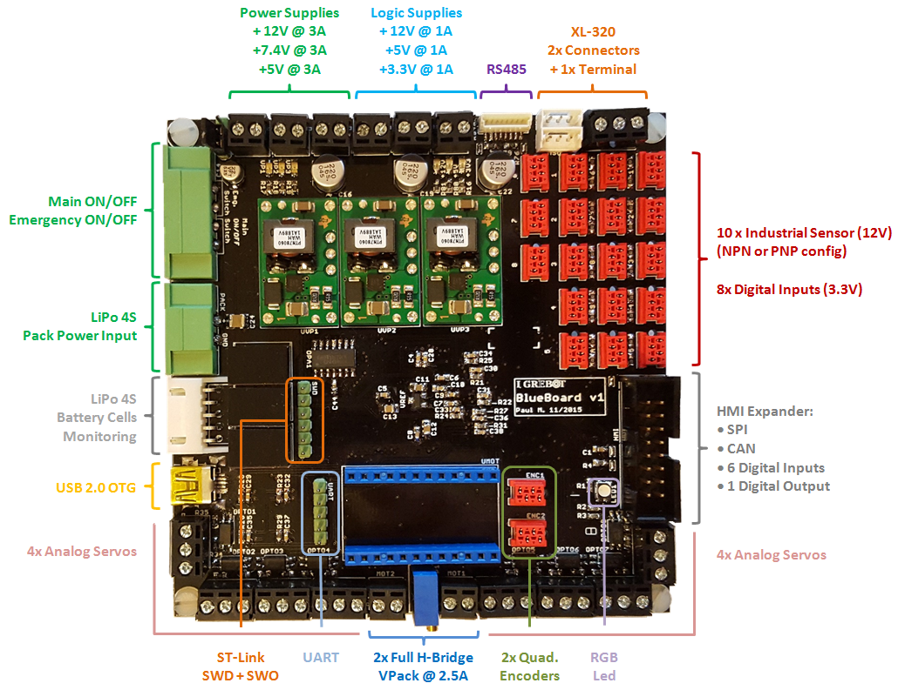

# BlueBoard v1

The BlueBoard is a small form-factor "all-in-one" electronic board for 2 wheels robots.

## Features

The board features the following items:

* Compact size: 10 cm x 10 cm
* Single input power-supply (+14V min)
* Integrated Power-Supplies for logic domains using efficient DC/DC step-down regulators:
 * +12V/1A (industrial sensors)
 * +5V/1A (quadrature encoders, other 5V logic)
 * +3/3V/1A (most of digital logic)
* Integrated  Power-Supplies for heavy loads:
 * +12V/3A (generic purpose)
 * +7.4V/3A (dynamixel digital servos ~ can be adjusted)
 * +5V/3A (analog servos)
* Secure and robust Power-pack connector
* Main ON/OFF + Emergency switch connectors
* 2x Full H-Bridge output controls for DRV8842 (2.5A)
* 8x Opto-coupled analog-servos interface (PWM)
* 2x Connectors + 1x terminal for XL-320 digital servos interface
* 2x Quadrature encoders inputs
* 10x Opto-coupled Industrial sensor inputs (NPN/PNP  types selectable)
* 8x Digital Inputs
* RS485 connector for sensor-bus (to be used with ProxTof boards or other)
* UART with RTS/CTS signals
* USB 2.0 OTG connector
* ST-Link with SWD + SWO programming / debugging connector
* Expander connector (to be used with microBoard_HMI):
 * 1x SPI
 * 1x CAN
 * 6x Digital inputs (user selections switches)
 * 1x Digital outputs 

## Troubleshooting

* Mimimum input voltage (TEN / PTN modules) is high for 4S batteries (error due to 6S -> 4S design migration)
* Not working 4S battery cell monitoring analog circuit (to be further checked)